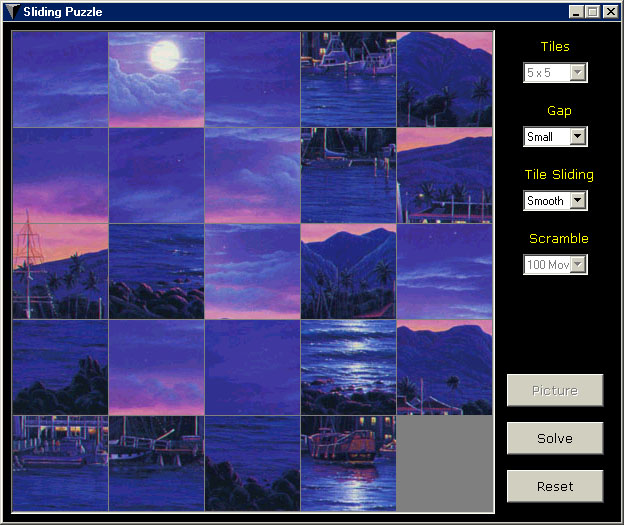



## Sliding Tile Puzzle

### Description

This is a sliding tile puzzle game. Reassemble the scrambled picture by sliding the tiles around. You might want to view the screenshot to see what I mean. The nice thing about this game is you can use any picture you want (image size is 480x480). Also you can have anywhere from 9 tiles (3x3) to 100 (10x10). If you modify the code slightly you can have as many tiles as you want, actually.
 
### More Info
 
Use the arrow keys to slide the tiles. Pressing the Ctrl key will show you all the tiles which are currently out of place (helps if some tiles look very similar to each other).

             |
---                |---
**Submitted On**   |2001-06-23 14:11:36
**By**             |[Jeremiah Hughes](https://github.com/Planet-Source-Code/PSCIndex/blob/master/ByAuthor/jeremiah-hughes.md)
**Level**          |Advanced
**User Rating**    |5.0 (20 globes from 4 users)
**Compatibility**  |VB 6\.0
**Category**       |[Games](https://github.com/Planet-Source-Code/PSCIndex/blob/master/ByCategory/games__1-38.md)
**World**          |[Visual Basic](https://github.com/Planet-Source-Code/PSCIndex/blob/master/ByWorld/visual-basic.md)
**Archive File**   |[Sliding Ti215726232001\.zip](https://github.com/Planet-Source-Code/jeremiah-hughes-sliding-tile-puzzle__1-24364/archive/master.zip)

